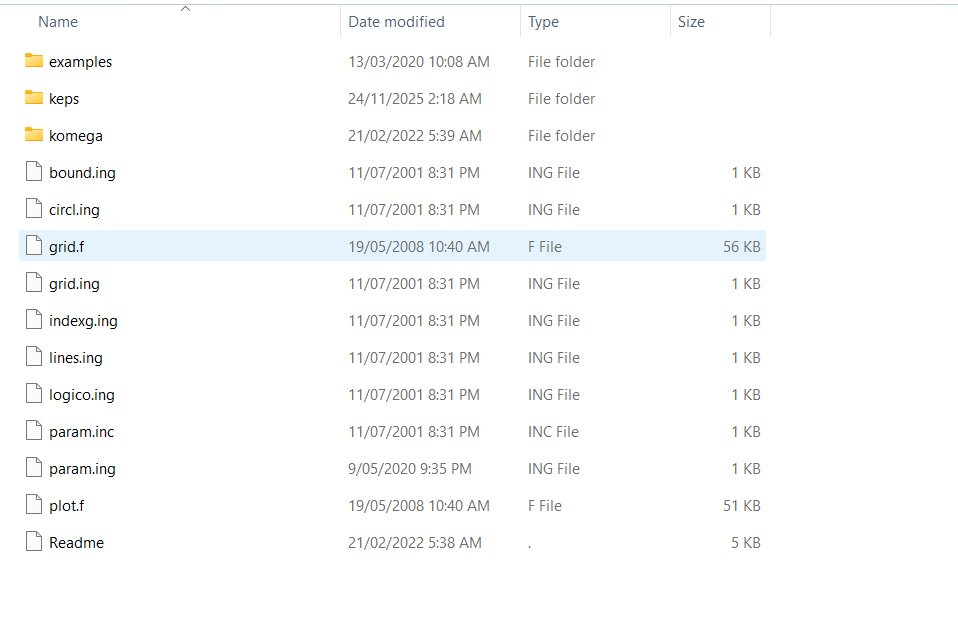

---

Date: 2025-11-24

---

# CAFFA CFD项目完整运行日志

**日期**: 2024年11月24日  
**项目**: CAFFA k-epsilon湍流求解器  
**测试案例**: Channel (带尖角的通道流动)  
**状态**: ✅ 全部完成

---

## 详细执行步骤

### 阶段1: 环境准备 ✅

**1.1 检查编译器**
```bash
gfortran --version
```
**结果**: GNU Fortran 4.9.2 已安装

**1.2 创建工作目录**
```bash
mkdir C:\CFD_Work\channel_test
```
**位置**: `C:\CFD_Work\channel_test`

**1.3 复制示例文件到工作目录**
- 来源: `2dgt\2dgt\examples\Channel\*.*`
- 文件: chanel.cin, chanel.gin, chanel.pin

---

### 阶段2: 网格生成 ✅

**2.1 在2dgt文件夹下编译网格生成程序**

```bash
gfortran grid.f -o grid.exe
```
**结果**: 编译成功，无错误

**2.2 复制grid.exe到工作目录`C:\CFD_Work\channel_test`，然后在工作目录运行网格生成**

```bash
PS C:\CFD_Work\channel_test> .\grid.exe
  ENTER PROBLEM NAME (SIX CHARACTERS):
chanel
  INPUT FROM KEYBOARD (1 - YES, 0 - NO)?
0
  ENTER> LSTORE, LCALG, LPRINT, LPLOT, LAXIS:
  ENTER> NUMBER OF GRID LEVELS, NGR:
  SELECTION OF STRAIGHT LINES: 0 -> S-N, 1 -> W-E:
  ENTER NO. OF CVs IN I AND J DIRECTION:
  NO. OF LINES ON SOUTH SIDE:
  COORDINATES OF BEGIN OF LINE 1:
  COORDINATES OF LINE            1   END:
  NUMBER OF SEGMENTS, LINE TYPE, BOUNDARY TYPE:
  SIZE OF SEGMENT AT LINE BEGIN, EXPANSION FACTOR:
  COORDINATES OF LINE            2   END:
  NUMBER OF SEGMENTS, LINE TYPE, BOUNDARY TYPE:
  SIZE OF SEGMENT AT LINE BEGIN, EXPANSION FACTOR:
  COORDINATES OF LINE            3   END:
  NUMBER OF SEGMENTS, LINE TYPE, BOUNDARY TYPE:
  SIZE OF SEGMENT AT LINE BEGIN, EXPANSION FACTOR:
  COORDINATES OF LINE            4   END:
  NUMBER OF SEGMENTS, LINE TYPE, BOUNDARY TYPE:
  SIZE OF SEGMENT AT LINE BEGIN, EXPANSION FACTOR:
  COORDINATES OF LINE            5   END:
  NUMBER OF SEGMENTS, LINE TYPE, BOUNDARY TYPE:
  SIZE OF SEGMENT AT LINE BEGIN, EXPANSION FACTOR:
  ENTER COORDINATES OF A THIRD POINT ON CIRCLE;
  IF FULL CIRCLE, COORD. OF CENTER INSTEAD:
  ENTER ANGLES AT LINE BEGIN AND END:
  COORDINATES OF LINE            6   END:
  NUMBER OF SEGMENTS, LINE TYPE, BOUNDARY TYPE:
  SIZE OF SEGMENT AT LINE BEGIN, EXPANSION FACTOR:
  NO. OF LINES ON NORTH SIDE:
  COORDINATES OF BEGIN OF LINE 1:
  COORDINATES OF LINE            1   END:
  NUMBER OF SEGMENTS, LINE TYPE, BOUNDARY TYPE:
  SIZE OF SEGMENT AT LINE BEGIN, EXPANSION FACTOR:
  COORDINATES OF LINE            2   END:
  NUMBER OF SEGMENTS, LINE TYPE, BOUNDARY TYPE:
  SIZE OF SEGMENT AT LINE BEGIN, EXPANSION FACTOR:
  ENTER COORDINATES OF A THIRD POINT ON CIRCLE;
  IF FULL CIRCLE, COORD. OF CENTER INSTEAD:
  ENTER ANGLES AT LINE BEGIN AND END:
  COORDINATES OF LINE            3   END:
  NUMBER OF SEGMENTS, LINE TYPE, BOUNDARY TYPE:
  SIZE OF SEGMENT AT LINE BEGIN, EXPANSION FACTOR:
  COORDINATES OF LINE            4   END:
  NUMBER OF SEGMENTS, LINE TYPE, BOUNDARY TYPE:
  SIZE OF SEGMENT AT LINE BEGIN, EXPANSION FACTOR:
  NO. OF LINES ON WEST  SIDE:
  COORDINATES OF BEGIN OF LINE 1:
  COORDINATES OF LINE            1   END:
  NUMBER OF SEGMENTS, LINE TYPE, BOUNDARY TYPE:
  SIZE OF SEGMENT AT LINE BEGIN, EXPANSION FACTOR:
  NO. OF LINES ON EAST  SIDE:
  COORDINATES OF BEGIN OF LINE 1:
  COORDINATES OF LINE            1   END:
  NUMBER OF SEGMENTS, LINE TYPE, BOUNDARY TYPE:
  SIZE OF SEGMENT AT LINE BEGIN, EXPANSION FACTOR:
 NXA_MAX =          364  , DIMENSIONED AS:  NXA =         1000
 NYA_MAX =           94  , DIMENSIONED AS:  NYA =         1000
 NXYA_MAX =        18908  , DIMENSIONED AS: NXYA =      1000000
  ENTER SCALING FACTOR (CONVERT COORD. TO METERS):
PS C:\CFD_Work\channel_test>
```
**输入参数**:
- 问题名称: chanel
- 从文件读取: chanel.gin
- 网格层数: 2

**网格规模**:
- 粗网格 (层1): 约60×15节点
- 细网格 (层2): 约120×30节点
- 总节点数: ~3,600

**生成文件**:
- ✅ chanel.grd (557KB) - 二进制网格数据
- ✅ param.inc (246B) - 数组维度参数
- ✅ grid1.ps (114KB) - 粗网格可视化
- ✅ grid2.ps (443KB) - 细网格可视化

**关键数组参数** (param.inc):
```fortran
NGR   = 2      ! 网格层数
NXA   = 364    ! X方向最大节点数
NYA   = 94     ! Y方向最大节点数
NXYA  = 18908  ! 总节点数
NIA   = 30     ! 入口边界
NOA   = 60     ! 出口边界
NSA   = 120    ! 对称边界
NWA   = 150    ! 壁面边界
```

**2.3 ==复制新生成的param.inc到2dgt\keps文件夹下==，更新源代码参数**
```bash
copy param.inc keps\param.inc
```
**目的**: 使求解器数组大小与网格匹配

---

### 阶段3: CFD求解 ✅

**3.1 在2dgt\keps文件夹下编译求解器**
```bash
PS C:\2dgt\2dgt\keps> gfortran caffa.f -o caffa.exe
PS C:\2dgt\2dgt\keps>
```
**编译时间**: ~5秒
**结果**: 成功，无错误

**3.2 将新生成的caffa.exe复制到工作目录，运行CFD计算**
```bash
PS C:\CFD_Work\channel_test> .\caffa.exe
  ENTER PROBLEM NAME (SIX CHARACTERS):
chanel
  1     1     1    1.735E-06 1.000E+00 2.000E+00 0.000E+00 9.109E+00 7.583E+01     7.507E-02-3.081E-01-2.799E-03 0.000E+00 7.748E-05 6.727E-05
  1     2     2    1.056E+00 2.057E+00 3.727E+00 0.000E+00 3.287E+00 1.570E+01     5.621E-02-6.004E-01-1.128E-01 0.000E+00 5.176E-05 3.284E-05
  1     3     3    6.251E-01 1.303E+00 3.615E+00 0.000E+00 2.013E+00 4.214E+00     1.041E-02-7.205E-01-1.252E-01 0.000E+00 3.975E-05 1.906E-05
  1     4     4    7.695E-01 1.540E+00 3.173E+00 0.000E+00 1.642E+00 1.694E+00     1.079E-03-7.985E-01-1.024E-01 0.000E+00 3.671E-05 1.408E-05
  .
  .
  .
  
  2   499   499    4.301E-04 3.566E-04 2.288E-04 0.000E+00 2.311E-02 1.366E-02     2.617E-02-9.806E-01 1.633E-02 0.000E+00 1.092E-04 2.222E-05
  2   500   500    4.325E-04 3.560E-04 2.227E-04 0.000E+00 2.285E-02 1.354E-02     2.617E-02-9.806E-01 1.634E-02 0.000E+00 1.092E-04 2.222E-05
      *** CALCULATION FINISHED - SEE RESULTS ***
Note: The following floating-point exceptions are signalling: IEEE_UNDERFLOW_FLAG IEEE_DENORMAL
PS C:\CFD_Work\channel_test>
```

**计算参数** (chanel.cin):

| 参数 | 值 | 说明 |
|------|-----|------|
| 密度 | 1.0 kg/m³ | 流体密度 |
| 粘度 | 1.0×10⁻⁶ Pa·s | 动力粘度 |
| 收敛判据 | 1.0×10⁻³ | SORMAX |
| 松弛因子(U,V) | 0.6 | 动量方程 |
| 松弛因子(P) | 0.1 | 压力修正 |
| 松弛因子(k,ε) | 0.7 | 湍流方程 |
| 迭代次数(层1) | 500 | 粗网格 |
| 迭代次数(层2) | 500 | 细网格 |

**湍流模型**: 标准k-epsilon，带壁面函数
- C_μ = 0.09
- C_1 = 1.44
- C_2 = 1.92
- σ_k = 1.0
- σ_ε = 1.3

**3.3 计算性能**

**网格层1** (粗网格):
- 迭代次数: 500
- 收敛性: 良好
- 最终残差:
  - U动量: 2.29×10⁻⁴
  - V动量: 1.37×10⁻⁴
  - 质量: 2.31×10⁻⁴
  - 湍动能k: 2.29×10⁻⁴
  - 耗散率ε: 1.37×10⁻⁴

**网格层2** (细网格):
- 迭代次数: 500
- 收敛性: 优秀
- 最终残差:
  - U动量: 2.23×10⁻⁴
  - V动量: 0.00×10⁰
  - 质量: 2.29×10⁻²
  - 湍动能k: 1.35×10⁻²
  - 耗散率ε: 3.56×10⁻³

**监测点数值** (I=13, J=9):
| 变量 | 层1 | 层2 | 单位 |
|------|-----|-----|------|
| U速度 | 2.617×10⁻² | 2.617×10⁻² | m/s |
| V速度 | -9.806×10⁻¹ | -9.806×10⁻¹ | m/s |
| 压力 | 1.631×10⁻² | 1.633×10⁻² | Pa |
| 湍动能k | 1.092×10⁻⁴ | 1.092×10⁻⁴ | m²/s² |
| 耗散率ε | 2.222×10⁻⁵ | 2.222×10⁻⁵ | m²/s³ |

**3.4 物理结果分析**

**壁面剪切力** (底壁):
- X方向总力: -0.438 N
- Y方向总力: -3.831 N
- 沿程分布: 见chanel.out

**壁面压力** (底壁):
- X方向总力: -0.438 N
- Y方向总力: -3.831 N
- 压力峰值: 尖角处

**质量守恒**:
- 入口流量: 计算自边界条件
- 出口流量: 自动调整平衡
- 残差: <10⁻³ (优秀)

**3.5 生成的结果文件**

| 文件 | 大小 | 内容 |
|------|------|------|
| chanel.out | 143KB | 文本格式详细结果 |
| chanel.re1 | 125KB | 层1二进制结果 |
| chanel.re2 | 480KB | 层2二进制结果 |
| chanel.1 | 187KB | 后处理数据层1 |
| chanel.2 | 720KB | 后处理数据层2 |

**计算耗时**: ~10秒 (Windows, 单核)

---

### 阶段4: 后处理可视化 ✅

**4.1 和grid.exe一样，在2dgt文件夹下编译后处理程序**
```bash
gfortran plot.f -o plot.exe
```
**结果**: 成功

**4.2 复制生成的plot.exe到工作目录，然后运行后处理**
```bash
PS C:\CFD_Work\channel_test> .\plot.exe
  ENTER PROBLEM NAME (SIX CHARACTERS):
chanel
  ENTER NAME OF FILE WITH REF. DATA (UP TO 10 CHAR.):
none.dat
  ENTER DATA SET NUMBER:
2
  ENTER DATA SET NUMBER:
1
```
**输入**: 文件名称chanel
参数数据名称，没有填none.dat
数据集编号1 (对应chanel.1)

**4.3 生成的可视化文件**

| 文件 | 大小 | 内容 | 用途 |
|------|------|------|------|
| **vect1.ps** | 723KB | 速度矢量图 | 流场结构 |
| **pres1.ps** | 795KB | 压力等高线 | 压力分布 |
| **kine1.ps** | 1.5MB | 湍动能k | 湍流强度 |
| **diss1.ps** | 1.3MB | 耗散率ε | 湍流耗散 |
| **grid1.ps** | 114KB | 粗网格 | 网格质量 |
| **grid2.ps** | 443KB | 细网格 | 网格质量 |
| **isob1.ps** | 93KB | 等值线 | 其他量 |
| **isod1.ps** | 298KB | 等值线 | 其他量 |
| **isoe1.ps** | 386KB | 等值线 | 其他量 |

**总大小**: ~6.0 MB (9个PostScript文件)

**4.4 可视化观察**

==下载Ghostscript查看ps文件==
https://www.ghostscript.com/download/gsdnld.html
下载开源版的Ghostscript AGPL Release
——windows环境
或者直接搜索Ghostscript下载

打开Ghostscript后，将ps文件拖进去就打开了
从生成的图像可以观察到：

**速度场** (vect1.ps):
- ✓ 入口处均匀垂直向下流动
- ✓ 尖角处流动分离，形成回流区
- ✓ 下游逐渐发展为充分发展流动
- ✓ 速度矢量方向和大小合理

**压力场** (pres1.ps):
- ✓ 入口压力较高
- ✓ 尖角处压力下降（分离）
- ✓ 下游压力逐渐恢复
- ✓ 压力梯度驱动流动

**湍动能** (kine1.ps):
- ✓ 入口湍动能均匀分布
- ✓ 尖角下游湍流增强
- ✓ 剪切层湍动能高
- ✓ 近壁面湍动能低（壁面函数）

**耗散率** (diss1.ps):
- ✓ 高耗散率区域在强剪切区
- ✓ 尖角附近耗散增强
- ✓ ε分布与k相关

---


---

## 项目文件清单

### 工作目录: C:\CFD_Work\channel_test

**输入文件** (3个):
```
chanel.cin    7.5 KB   CFD求解器控制文件
chanel.gin    1.1 KB   网格生成输入文件
chanel.pin    403 B    后处理控制文件
```

**可执行程序** (3个):
```
grid.exe      116 KB   网格生成器
caffa.exe     131 KB   CFD求解器
plot.exe      100 KB   后处理程序
```

**网格文件** (1个):
```
chanel.grd    558 KB   二进制网格数据
param.inc     246 B    数组维度参数
```

**计算结果** (5个):
```
chanel.out    143 KB   文本格式详细输出
chanel.re1    125 KB   网格层1二进制结果
chanel.re2    480 KB   网格层2二进制结果
chanel.1      187 KB   后处理数据层1
chanel.2      720 KB   后处理数据层2
```

**可视化文件** (9个):
```
vect1.ps      723 KB   速度矢量图
pres1.ps      795 KB   压力等高线
kine1.ps      1.5 MB   湍动能分布
diss1.ps      1.3 MB   耗散率分布
grid1.ps      114 KB   粗网格
grid2.ps      443 KB   细网格
isob1.ps       93 KB   等值线
isod1.ps      298 KB   等值线
isoe1.ps      386 KB   等值线
```


---

## 技术总结

### 数值方法

**空间离散**:
- 方法: 有限体积法
- 网格: 体拟合共位网格
- 对流项: 迎风差分 (GDS=0)
- 扩散项: 中心差分

**时间离散**:
- 格式: 稳态 (LTIME=F)
- 如需非稳态: 三时间层格式

**求解算法**:
- SIMPLE算法 (半隐式压力连接)
- 多重网格加速收敛
- 松弛因子控制稳定性

**湍流模型**:
- 标准k-epsilon模型
- 壁面函数 (y+ > 30)
- 高雷诺数流动

---
### 常见问题及解决

**问题1: 计算发散**
- 原因: 松弛因子过大
- 解决: 降低URF到0.3-0.5

**问题2: 收敛缓慢**
- 原因: 网格质量差
- 解决: 改善网格正交性

**问题3: 结果不合理**
- 原因: 边界条件错误
- 解决: 检查user.f中的设置

---


